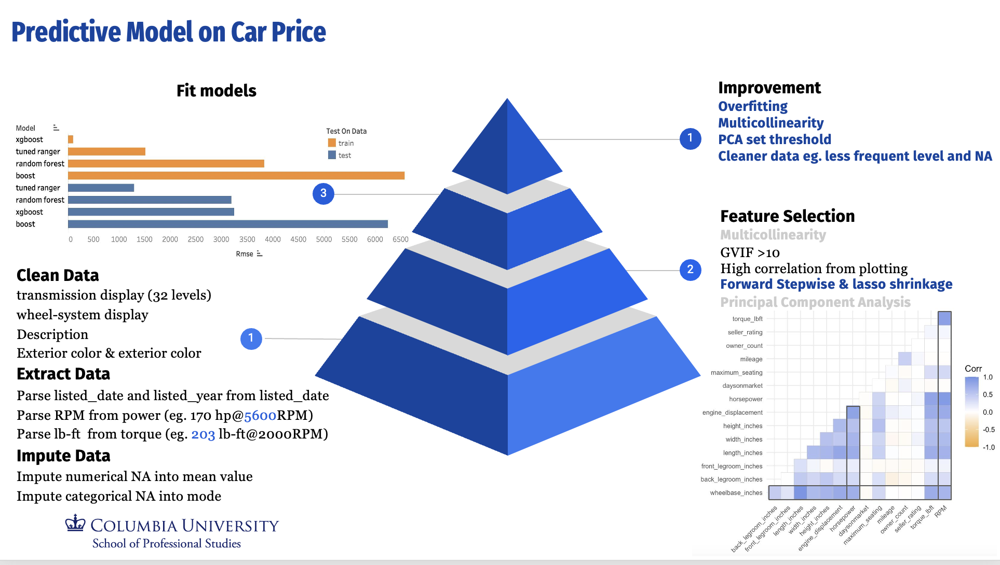

# Used Car Price Prediction & Analysis (PAC Competition)

This repository contains a comprehensive predictive modeling workflow implemented in R to forecast used car prices. This project was developed as part of the PAC Competition, achieving highly competitive results through meticulous data engineering, multi-model benchmarking, and advanced gradient boosting techniques.

## 🗺️ Project Architecture & Pipeline
The diagram below provides an absolute, end-to-end panoramic overview of our data pipeline, encompassing feature extraction, imputation strategies, collinearity identification, multi-model validation scores, and critical architectural reflections:



---

## 📌 Project Overview
Predicting the resale value of used cars is a complex task influenced by both intrinsic vehicle features and dynamic market conditions. The original dataset provided was highly complex and messy, containing missing values, high-cardinality categorical fields, overlapping variables, and redundant text descriptions. 

This project establishes a rigorous, production-grade statistical analytics pipeline—from raw data munging to hyperparameter optimization.

---

## 🛠️ Tech Stack & Dependencies
- **Language:** R
- **Key Libraries:** `dplyr`, `lubridate`, `readr`, `caret`, `randomForest`, `ranger`, `gbm`, `vtreat`, `xgboost`, `glmnet`

---

## 📊 1. Data Cleaning & Preprocessing

To combat overfitting and minimize unnecessary computational overhead, the raw data underwent structured cleaning and dimensional reductions:

### Feature Consolidation & Simplification
- **Overlapping Features:** Identified and resolved redundant variables. Replaced complex columns like `transmission-display` (32 distinct levels) and `wheel-system display` with their simplified versions (`transmission` with only 5 levels, and `wheel-system`), preventing categorical inflation.
- **Text Deletion:** Removed the unstructured `description` column as the core predictive values were already embedded within other structured indicators.
- **Color Standardization:** Eliminated overly verbose descriptions in interior and exterior colors by leveraging the clean, consolidated `listing_color` variable.

### Advanced Feature Extraction (Regex Parsing)
- **Engine Power:** Parsed the text field `power` to extract raw numerical RPM (e.g., transforming `"170 hp @ 5600RPM"` into `5600`).
- **Torque:** Parsed complex `torque` string patterns into a standardized numerical column in lb-ft and its respective RPM bounds.
- **Temporal Seasonality:** Utilized `lubridate` to decompose `listed_date` into categorical elements (`listed_year`, `listed_month`) to capture cyclical valuation shifts.

### Imputation Strategy
- **Numerical Variables:** Addressed missing data (`NA`) in metrics like mileage, fuel economy, and engine displacement using **Column Mean Imputation**.
- **Categorical Variables:** Resolved missing factor dimensions via **Mode Imputation**.
- **Pipeline Alignment:** Enforced structural factor level synchronization between the training dataset and the external test scoring sets to prevent execution crashes.

---

## 🔍 2. Feature Selection & Regularization

To isolate high-signal predictors and completely mitigate **Multicollinearity**, a strict selection protocol was established:
1. **Multicollinearity Check:** Evaluated Generalized Variance Inflation Factors (GVIF). Features with `GVIF > 10` and tightly correlated variables identified via correlation plotting were heavily filtered.
2. **Forward Stepwise Selection:** Built an incremental parametric path to benchmark baseline informational criteria (AIC).
3. **Lasso Shrinkage (`glmnet`):** Executed L1 regularization to penalize redundant variances and zero out minor weights, establishing premium core predictors such as `horsepower`, `year`, `make_name`, `mileage`, and `has_accidents`.

---

## 🤖 3. Model Architecture & Benchmarking

The processed pipeline was modeled across five distinct frameworks, evaluated through a strict 80/20 train/test partition:

| Model Architecture | Description & Tuning Strategy |
| :--- | :--- |
| **Linear Regression (`lm`)** | Baseline parametric model to gauge linear relationship strengths and benchmark feature sets. |
| **Random Forest (`randomForest`)** | Bagging ensemble consisting of 200 decision trees to isolate non-linear variance splits. |
| **Gradient Boosting Machine (`gbm`)** | Sequential boosting optimization trained with 200 trees, an interaction depth of 10, and a shrinkage rate of 0.01. |
| **Tuned Random Forest (`ranger`)** | Highly optimized via **5-fold Cross-Validation** to lock the absolute best hyperparameters for `mtry`, `splitrule`, and `min.node.size`. |
| **XGBoost (`xgboost`)** | Advanced extreme gradient boosting using hand-coded one-hot encoding via a `vtreat` mapping configuration, optimized using early stopping flags. |

### 📈 Key Evaluation Results
The **XGBoost** model demonstrated exceptional predictive accuracy and optimization metrics on unseen testing targets:
- **XGBoost Train RMSE:** `~0.35`
- **XGBoost Test RMSE:** `~26.13`

---

## 💡 4. Project Reflection & Future Improvements

Evaluating the final workflow yields several invaluable optimization strategies for subsequent model updates:

- **Advanced Imputation Methods:** Migrating away from baseline mean/mode replacements toward **Bagged Decision Trees Imputation** would drastically enhance accuracy by treating complex numerical and categorical data cross-dependencies simultaneously.
- **Contextual Imputation Audits:** Heavy missingness data needs a context-dependent verification. Variables with nearly 50% missing rows (e.g., `has_accident`, `isCab`, `fleet`, `salvage`) should be carefully evaluated to check if an omission is structurally indicative of a status (e.g., "No Accident reported") rather than missing at random.
- **Consolidation of Rare Levels:** Infrequent levels (e.g., the `"Dual Dutch"` transmission level appearing only 129 times out of 40,000 data rows) must be grouped together early to stop highly local overfitting.
- **Collinearity & Overlap Reviews:** Feature engineering loops must be audited to prevent duplicate proxy signals (e.g., checking that engineered flags like `"sport"` do not silently mirror manual transmission `"M"`, or `"alloy wheel"` duplicating `"premium"` packages).

---

## 🚀 How to Run the Script
1. Clone the repository:
   ```bash
   git clone [https://github.com/chilldrenchi/Used-Car-Price-Analysis.git](https://github.com/chilldrenchi/Used-Car-Price-Analysis.git)

2. Open PAC Model.R in your R development console (e.g., RStudio) & Download the data named verison1. 

3. Path Modification Note: The script references static absolute local file directories (e.g., /Users/skychi/Desktop/...). Please change the file system locations inside the read.csv() blocks to map to your specific local folder directories housing the analysisData and scoringData sets.

4. Install all missing dependent libraries and source the file to run data cleaning routines, execute tests, and output valuation sets.
